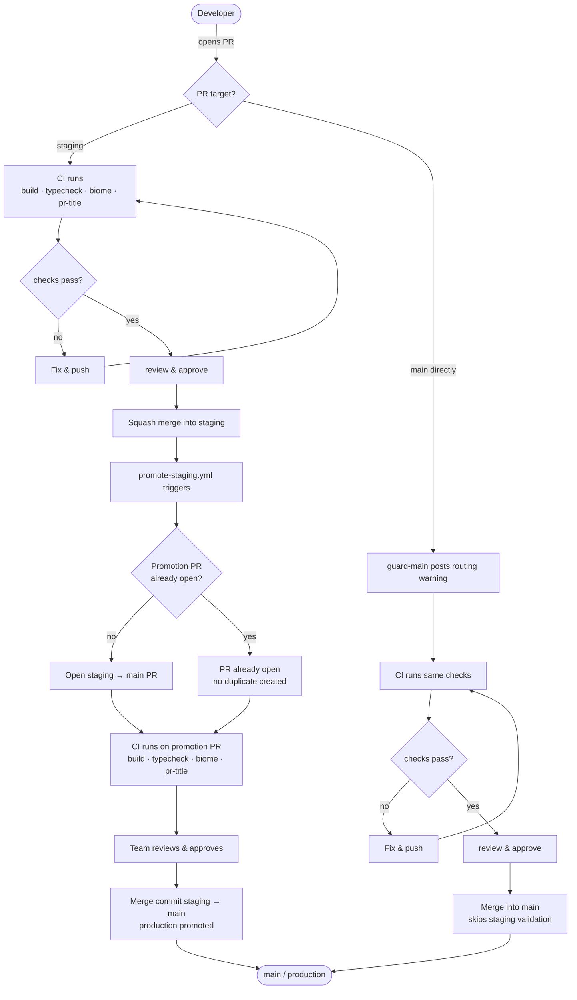
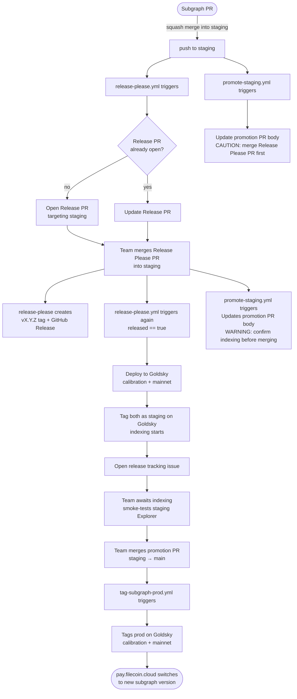

# Release Process

This document describes how each part of the monorepo is released and deployed.

## Rule: all PRs target `staging`

**Every PR in this repo — apps, subgraph, and internal packages — must target `staging` first.**

This keeps the two branches in sync and avoids divergence. The subgraph and the apps are tightly coupled (schema changes require regenerating `packages/types` and updating explorer queries), so shipping them independently is rarely meaningful in practice. Routing everything through `staging` ensures they always land together.

The `guard-main` workflow enforces this by posting a warning on any PR that targets `main` directly.

---

## Apps — `apps/explorer` and `apps/notification-service`

These two apps use a two-branch promotion model. `staging` is the integration branch where all feature work lands. `main` is the production gate, code reaches it only through an explicit promotion step.

```
feature → staging → main (production)
```

### Branch roles

| Branch | Role |
|---|---|
| `staging` | Integration branch. All PRs in this repo target this. Reflects what is deployed to the staging environment. |
| `main` | Production branch. Updated only via the promotion PR. Triggers production deployments on merge. |

### Flow



### Step by step

**1. Feature development**

Open a PR targeting `staging`. CI runs automatically:

- `build` — compiles all affected packages
- `typecheck` — TypeScript type validation
- `biome` — lint and format
- `pr-title` — enforces conventional commit format on the PR title

CODEOWNERS are notified for review. Squash merge when approved.

**2. Automatic promotion PR**

Every push to `staging` triggers `.github/workflows/promote-staging.yml`, which:

- Skips if `staging` and `main` have identical file content (`git diff`) — content-based, not commit-based, so back-merges via squash or cherry-pick don't trigger no-op PRs
- Generates the commit list using `git log` — history-based and best effort; in squash/cherry-pick back-merge edge cases it may list commits already on `main`, but the PR diff will be empty and reviewers will notice
- Opens a `staging → main` PR titled `chore: promote staging to production` if none exists
- Updates the PR body with the current commit list if the PR already exists

The promotion PR body lists all commits on `staging` not yet on `main`, so reviewers have full context on what is being deployed. Concurrent pushes to `staging` are serialized via a concurrency group, runs queue rather than race.

When subgraph changes are detected, the body also includes one of two warnings:
- `CAUTION` — subgraph code changed but no version bump yet. The Release Please PR has not been merged. **Do not merge the promotion PR until the Release Please PR is merged first.**
- `WARNING` — version bumped and Goldsky deployment is done. Confirm indexing is complete before merging.

**3. Promoting to production**

Review and approve the promotion PR. Merge it using a **merge commit** (not squash). This triggers any production deployment pipelines configured on `main`.

### Merge strategy requirement

The promotion PR **must be merged with a merge commit**, not a squash merge. Squash-merging creates a single commit on `main` that does not share ancestry with `staging`'s commits, on the next push to `staging`, the workflow would see those commits as still unreachable from `main` and re-list them in the promotion PR body.

Enforce this via the repository's branch protection settings: allow only merge commits on `main`.

### Direct merges to `main`

If a fix must bypass `staging` for any reason, open the PR directly against `main`. The `guard-main` workflow posts a routing warning, advisory, not a block. Proceed with the normal review and merge flow.

After the PR lands on `main`, **immediately back-merge into `staging`** to keep the branches in sync.

Skipping the back-merge causes `staging` to diverge from `main`. The next promotion PR will have conflicts and reviewers will see changes that are already on `main` listed as pending.

### What is automated vs manual

| Step | Automated | Manual |
|---|---|---|
| CI checks on feature PRs | Yes | — |
| CI checks on promotion PR | Yes | — |
| Opening the promotion PR | Yes | — |
| Updating the promotion PR body | Yes | — |
| Reviewing and merging the promotion PR | — | Yes |
| Back-merging hotfixes into staging | — | Yes |

---

## Subgraph — `packages/subgraph`

Subgraph PRs follow the same flow as everything else: target `staging`, get reviewed, squash merge. The subgraph and the explorer are tightly coupled, schema changes require regenerating `packages/types` and updating explorer queries, so they should land together.

The subgraph release cycle is managed by [release-please](https://github.com/googleapis/release-please). Every push to `staging` triggers `.github/workflows/release-please.yml`, which maintains a Release PR targeting `staging`. Merging that Release PR:

1. Creates a git tag and GitHub Release at the new version
2. Deploys the subgraph to Goldsky on both `calibration` and `mainnet` networks
3. Tags both deployments as `staging` on Goldsky — the staging Explorer switches to the new version immediately (data may be partially indexed)
4. Opens a release tracking issue to track indexing and verification

Deployment requires the `GOLDSKY_API_KEY` repository secret.

The version bump and `CHANGELOG.md` update land on `staging` first and travel to `main` via the normal promotion PR — no back-merge needed.

**Promoting to production.** After the subgraph finishes indexing and the Explorer is verified on staging, merge the promotion PR. This triggers `.github/workflows/tag-subgraph-prod.yml`, which reads the version from `packages/subgraph/package.json` and applies the `prod` tag on Goldsky. The production Explorer at `pay.filecoin.cloud` switches to the new fully-indexed subgraph automatically.

The release tracking issue checklist guides the verification steps between deploy and promotion.

### Flow



### Step by step

**1. Subgraph PR**

Open a PR targeting `staging` as usual. CI runs, get it reviewed, squash merge.

**2. Release Please PR**

Every push to `staging` triggers `release-please.yml`. It opens or updates a Release PR targeting `staging` that bumps `packages/subgraph/package.json` and updates `CHANGELOG.md`. Subsequent subgraph commits keep accumulating in the same Release PR until it is merged.

At the same time, `promote-staging.yml` updates the promotion PR body with a `CAUTION` block: subgraph code has changed but the version is not bumped yet — do not merge the promotion PR.

**3. Merge the Release Please PR**

When ready to release, merge the Release Please PR into `staging`. This triggers `release-please.yml` again, this time with `released == true`, which:

- Creates the git tag `vX.Y.Z` and GitHub Release
- Deploys to Goldsky on both `calibration` and `mainnet`
- Tags both deployments as `staging` — the staging Explorer switches to the new version (data may be partially indexed while Goldsky catches up)
- Opens a release tracking issue

`promote-staging.yml` also runs and updates the promotion PR body to replace the `CAUTION` with a `WARNING`: deployment is done, confirm indexing before merging.

**4. Await indexing and verify**

Follow the release tracking issue checklist:
- Monitor the [Goldsky dashboard](https://app.goldsky.com) until both networks finish indexing
- Smoke-test the Explorer on staging using the versioned subgraph URL from the tracking issue

**5. Merge the promotion PR**

Once indexing is confirmed and staging is verified, merge the promotion PR (`staging → main`). This triggers `tag-subgraph-prod.yml`, which applies the `prod` tag on Goldsky for both networks. The production Explorer at `pay.filecoin.cloud` switches to the new fully-indexed subgraph automatically.

### Known limitations

**Merge the Release Please PR before the promotion PR.**
When a subgraph PR merges into `staging`, two things happen simultaneously: the promotion PR is updated and the Release Please PR is created or updated. The promotion PR body detects this state and shows a `CAUTION` block warning reviewers not to merge yet. However, the warning is advisory — branch protection does not block the merge. The Release Please PR must always be merged into `staging` first so the Goldsky deployment and `staging` tag are applied before the code reaches `main`.

**Breaking schema changes require extra care.**
When the promotion PR merges into `main`, Vercel (Explorer) and `tag-subgraph-prod` both trigger at the same time. There is a brief window where the new Explorer and the new subgraph are not yet both live simultaneously. For non-breaking changes this is harmless. For breaking schema changes — where the new Explorer is incompatible with the old subgraph schema or vice versa — this window can cause a brief outage. The release tracking issue includes a callout for this case. The mitigation is to ensure the Explorer change is backwards-compatible with the previous subgraph version, or to coordinate the timing manually if that is not possible.

---

## Internal packages — `packages/ui`, `packages/types`, `packages/configs`

These packages have no independent release process. They are `private` and consumed directly by the apps at build time:

- `packages/ui` — shared React component library, exports source directly (no build step)
- `packages/types` — TypeScript types generated from the subgraph GraphQL schema
- `packages/configs` — shared tooling configuration (Biome, TypeScript, etc.)

Changes to these packages are picked up automatically when the consuming app is built.
