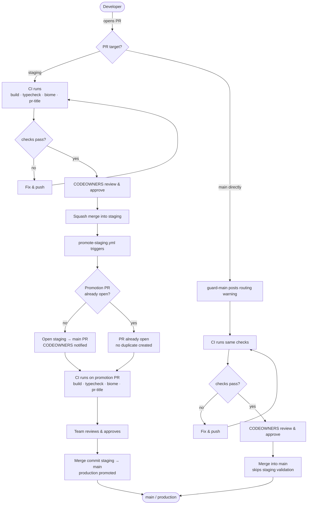

# Release Process

This document describes how each part of the monorepo is released and deployed.

## Rule: all PRs target `staging`

**Every PR in this repo — apps, subgraph, and internal packages — must target `staging` first.**

This keeps the two branches in sync and avoids divergence. The subgraph and the apps are tightly coupled (schema changes require regenerating `packages/types` and updating explorer queries), so shipping them independently is rarely meaningful in practice. Routing everything through `staging` ensures they always land together.

The `guard-main` workflow enforces this by posting a warning on any PR that targets `main` directly.

---

## Apps — `apps/explorer` and `apps/notification-service`

These two apps use a two-branch promotion model. `staging` is the integration branch where all feature work lands. `main` is the production gate, code reaches it only through an explicit promotion step.

```
feature → staging → main (production)
```

### Branch roles

| Branch | Role |
|---|---|
| `staging` | Integration branch. All PRs in this repo target this. Reflects what is deployed to the staging environment. |
| `main` | Production branch. Updated only via the promotion PR. Triggers production deployments on merge. |

### Flow



### Step by step

**1. Feature development**

Open a PR targeting `staging`. CI runs automatically:

- `build` — compiles all affected packages
- `typecheck` — TypeScript type validation
- `biome` — lint and format
- `pr-title` — enforces conventional commit format on the PR title

CODEOWNERS are notified for review. Squash merge when approved.

**2. Automatic promotion PR**

Every push to `staging` triggers `.github/workflows/promote-staging.yml`, which:

- Compares `staging` against `main` using `git log`
- Skips if staging is already up to date with main
- Opens a `staging → main` PR titled `chore: promote staging to production` if none exists
- Updates the PR body with the current commit list if the PR already exists

The promotion PR body lists all commits on `staging` not yet on `main`, so reviewers have full context on what is being deployed. Concurrent pushes to `staging` are serialized via a concurrency group, runs queue rather than race.

**3. Promoting to production**

Review and approve the promotion PR. Merge it using a **merge commit** (not squash). This triggers any production deployment pipelines configured on `main`.

### Merge strategy requirement

The promotion PR **must be merged with a merge commit**, not a squash merge. Squash-merging creates a single commit on `main` that does not share ancestry with `staging`'s commits, on the next push to `staging`, the workflow would see those commits as still unreachable from `main` and re-list them in the promotion PR body.

Enforce this via the repository's branch protection settings: allow only merge commits on `main`.

### Direct merges to `main`

If a fix must bypass `staging` for any reason, open the PR directly against `main`. The `guard-main` workflow posts a routing warning, advisory, not a block. Proceed with the normal review and merge flow.

After the PR lands on `main`, **immediately back-merge into `staging`** to keep the branches in sync.

Skipping the back-merge causes `staging` to diverge from `main`. The next promotion PR will have conflicts and reviewers will see changes that are already on `main` listed as pending.

### What is automated vs manual

| Step | Automated | Manual |
|---|---|---|
| CI checks on feature PRs | Yes | — |
| CI checks on promotion PR | Yes | — |
| Opening the promotion PR | Yes | — |
| Updating the promotion PR body | Yes | — |
| Reviewing and merging the promotion PR | — | Yes |
| Back-merging hotfixes into staging | — | Yes |

---

## Subgraph — `packages/subgraph`

Subgraph PRs follow the same flow as everything else: target `staging`, get reviewed, squash merge. The subgraph and the explorer are tightly coupled, schema changes require regenerating `packages/types` and updating explorer queries, so they should land together.

The subgraph release cycle is managed by [release-please](https://github.com/googleapis/release-please) and triggers automatically when `staging` is promoted to `main`. Every push to `main` triggers `.github/workflows/release-please.yml`, which maintains a Release PR. Merging that PR:

1. Creates a git tag and GitHub Release at the new version
2. Deploys the subgraph to Goldsky on both `calibration` and `mainnet` networks
3. Opens a release tracking issue for post-deploy verification

Deployment requires the `GOLDSKY_API_KEY` repository secret.

---

## Internal packages — `packages/ui`, `packages/types`, `packages/configs`

These packages have no independent release process. They are `private` and consumed directly by the apps at build time:

- `packages/ui` — shared React component library, exports source directly (no build step)
- `packages/types` — TypeScript types generated from the subgraph GraphQL schema
- `packages/configs` — shared tooling configuration (Biome, TypeScript, etc.)

Changes to these packages are picked up automatically when the consuming app is built.
